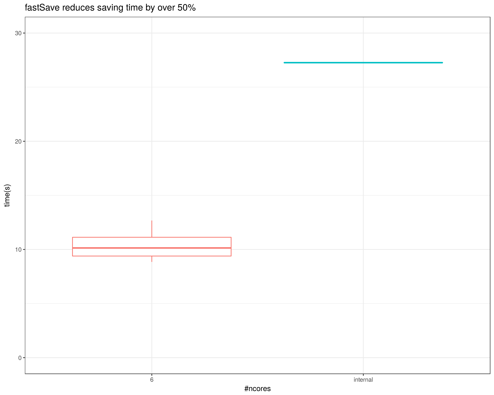
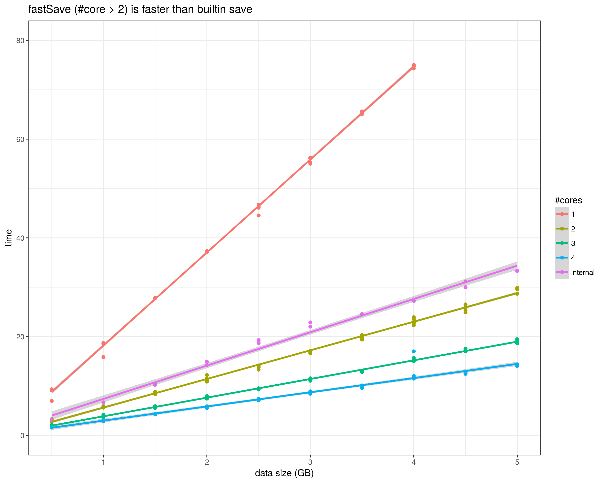

# fastSave: Save your R sessions faster!

As the scale of the data that is processed with R increases so
   does time to save sessions to disks. This package allows taking advantage of 
   parallel compression to reduce saving times.
   
# Benchmarks

Benchmarks were performed on a dual  Intel(R) Xeon(R) E5620  @ 2.40GHz system with 32 GB or RAM. 
The code to run the benchmarks on your system can be found in inst/benchmarks.R
