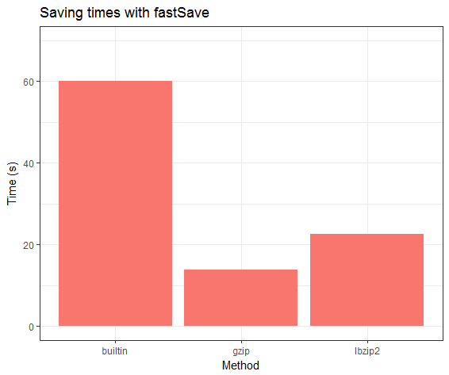
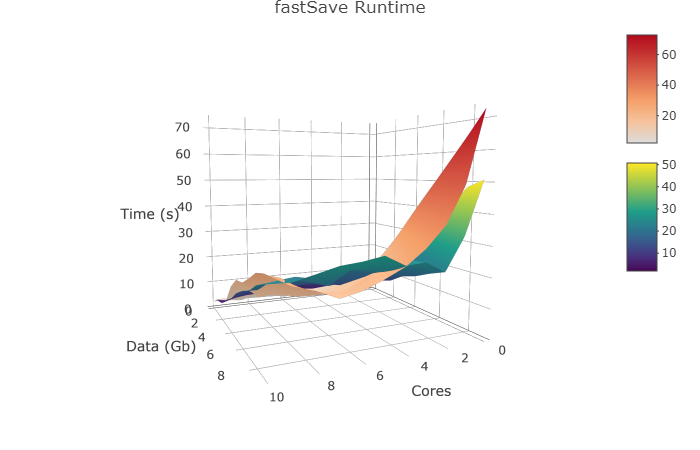

# fastSave: Save your R sessions faster!

As the scale of the data that is processed with R increases so
   does time to save sessions to disks. This package allows taking advantage of 
   parallel compression to reduce saving times.
   
# Benchmarks



Benchmarks were performed on a dual Intel(R) Xeon(R) E5670  @ 2.93GHz system with 48 GB or RAM. 
The code to run the benchmarks on your system can be found in inst/benchmarks.R

# Installation
fastSave only works on **unix systems** and requires the **pigz** to be installed, to use the lbzip2 functions you will also need **lbzip2** to be installed. On ubuntu you can install the requirements with:
```sh
sudo apt-get install pigz lbzip2
```

To install the fastSave R packages type the following on the R command prompt:
```R
library(devtools)
install_github('barkasn/fastSave')
```
## Use
fastSave provides the following  functions:

* save.fast()
* save.image.fast()
* save.lbzip2()
* save.image.lbzip2()
* load.lbzip2()

save.fast() and save.image.fast() produce files compatible with the standard load() function.  The save.lbzip2() and save.image.lbzip2() functions produce files that can be loaded with load.lbzip2(). Their advantage is that they allow the load operation to be parallelized as well.

To use fastSave simply load the package and replace your calls to save() and save.image() with save.fast() and save.image.fast(). You can use the n.cores argument to provide the number of cores to use. The default is 4 as most modern systems have at least 4 cores and saturation occurs beyond 8 cores anyway.
```R
## load the library
library(fastSave)

## Make an object
x <- rep(0,100)

## Save current enviromnment with function compatible with built-in save() and load()
## by default it will use ".RData" as a file
save.image.fast(file="mydata.RData", n.cores = 8)

## Save selected object only in "mydata.RData"
save.fast(x, file="x.RData",n.cores = 8)

## These files can be loaded with the normal load() function
load("x.RData")
```

```R
## Alternatively you can use the .lbzip2 functions. These produce files that are
## not compatible with the built in R functions but allow parallel loading.
## Note that saving with the lbzip2 functions takes slightly longer that
## with the functions above, but loading time is dramatically shorter.

## The use of the suffix .RDataFS is recommened for these files
## By default saves into files ".RDataFS"
save.image.lbzip2("mydata.RDataFS")
save.lbzip2(x, file="mydata.RDataFS")

## Load with selected function
load.lbzip2("mydata.RDataFS")
```

